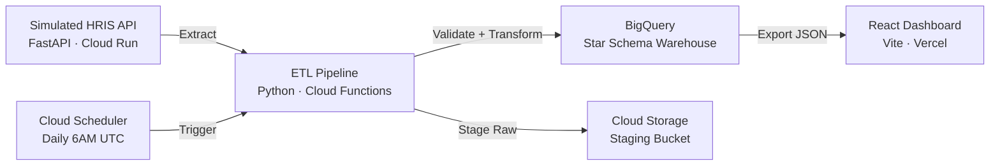

# WellNow Staffing Analytics

**People Analytics Data Pipeline — Multi-Location Workforce Staffing & Coverage Optimization**

[](https://www.python.org/)
[](https://fastapi.tiangolo.com/)
[](https://cloud.google.com/bigquery)
[](https://react.dev/)
[](LICENSE)
[](#cost)

A production-grade data pipeline and interactive dashboard for **WellNow Urgent Care** staffing optimization, built as a proof-of-concept for the Senior Analyst, Data & Insights role at **TAG — The Aspen Group**.

**Author:** Kriti Srivastava

---

## Architecture



| Component | Technology | GCP Service | Purpose |
|-----------|-----------|-------------|---------|
| HRIS API | FastAPI, Faker | Cloud Run | Simulated workforce data source |
| ETL Pipeline | Python, pandas, Pydantic | Cloud Functions | Extract → Validate → Transform → Load |
| Data Warehouse | SQL | BigQuery | Star-schema analytics (4 dims, 2 facts) |
| Dashboard | React, Tailwind, Recharts | Vercel | Interactive staffing analytics |
| Scheduler | cron | Cloud Scheduler | Daily pipeline orchestration |

## Key Metrics

| KPI | Definition | Target |
|-----|-----------|--------|
| Coverage Score | actual_provider_hours / required_provider_hours | 0.95–1.10 |
| Patients per Provider Hour | total_patient_visits / actual_provider_hours | ≥ 2.5 |
| Labor Cost per Visit | total_labor_cost / total_patient_visits | ≤ regional benchmark |
| Overtime Rate | overtime_hours / total_hours_worked | ≤ 8% |
| Shift Gap Frequency | shifts_with_gap / total_shifts | ≤ 10% |
| Callout Rate | callout_count / scheduled_shifts | ≤ 5% |
| Avg Wait Time | avg_wait_time_minutes per location | ≤ 25 min |
| Fill Rate | filled_positions / budgeted_positions | ≥ 90% |

## Data Scale

- **1,200** employees across **80** locations in **15** states
- **18 months** of daily scheduling and patient volume data
- **15** data quality validation rules
- **3** showcase SQL queries (window functions, CTEs, DENSE_RANK)

## Live Deployment

> **This POC runs on real GCP infrastructure** — BigQuery, Cloud Run, Cloud Functions,
> Cloud Scheduler, and Cloud Storage are all live, not local stubs.

| Layer | Service | Status |
|-------|---------|--------|
| HRIS API | Cloud Run | Deployed |
| ETL Pipeline | Cloud Functions 2nd Gen | Triggered daily by Cloud Scheduler |
| Data Warehouse | BigQuery (`people_analytics` dataset — 9 tables) | Live |
| Dashboard | Vercel | Deployed |

## Quickstart

### Prerequisites

- Python 3.11+
- Node.js 20+
- [Google Cloud SDK (`gcloud`)](https://cloud.google.com/sdk/docs/install) installed and authenticated
- GCP account with billing enabled (stays within free tier — see [Cost](#cost))
- [Vercel CLI](https://vercel.com/docs/cli) for dashboard deployment

### Local Development

```bash
# Clone the repository
git clone https://github.com/kriti-srivastava/wellnow-staffing-analytics.git
cd wellnow-staffing-analytics

# Copy environment variables
cp .env.example .env
# Edit .env with your values

# Install all dependencies
make setup

# Run the API locally
make run-api

# Run ETL pipeline locally (LOCAL_MODE writes to data/local_output/)
LOCAL_MODE=true python -m src.etl.pipeline

# Run the dashboard locally
make run-dashboard

# Run tests
make test
```

### GCP Deployment (Real Infrastructure)

```bash
# 1. One-time GCP project setup (enables APIs, creates buckets, sets billing alerts)
bash infrastructure/scripts/setup_gcp_project.sh

# 2. Store secrets in Secret Manager
bash infrastructure/scripts/setup_secrets.sh

# 3. Create BigQuery schema (runs all SQL DDL and seeds dim_date)
bash infrastructure/scripts/setup_bigquery.sh

# 4. Deploy HRIS API to Cloud Run
make deploy-api

# 5. Deploy ETL pipeline to Cloud Functions
make deploy-etl

# 6. Set up Cloud Scheduler (daily 6AM UTC trigger)
bash infrastructure/scripts/setup_scheduler.sh

# 7. Trigger first pipeline run manually
gcloud scheduler jobs run wellnow-etl-daily --location=us-central1

# 8. Deploy dashboard to Vercel
make deploy-dashboard
```

## Project Structure

```
wellnow-staffing-analytics/
├── src/
│   ├── api/          # Simulated HRIS API (FastAPI, independently deployable)
│   ├── etl/          # ETL pipeline (Python, independently deployable)
│   └── dashboard/    # React dashboard (Vite, independently deployable)
├── sql/
│   ├── schema/       # BigQuery table definitions (001-009)
│   ├── seed/         # dim_date seed data
│   └── queries/      # 3 showcase analytics queries
├── config/           # Shared configuration (quality rules, logging)
├── docs/             # Architecture, data dictionary, lineage, security
├── infrastructure/   # GCP deployment scripts and config
└── scripts/          # Developer utility scripts
```

## Documentation

| Document | Description |
|----------|-------------|
| [Architecture](docs/architecture.md) | System design, Mermaid diagrams, tech rationale |
| [Data Dictionary](docs/data_dictionary.md) | Every table, every field documented |
| [Data Lineage](docs/data_lineage.md) | Source → transform → destination mapping |
| [API Specification](docs/api_specification.md) | All endpoints with examples |
| [Security & Compliance](docs/security_and_compliance.md) | HIPAA awareness, audit trail |
| [Data Quality Runbook](docs/data_quality_runbook.md) | DQ monitoring and incident response |

## Cost

**$0/month** — entirely within GCP free tier:

| Service | Usage | Free Tier |
|---------|-------|-----------|
| BigQuery | ~50 MB storage, ~5 GB queries | 10 GB + 1 TB |
| Cloud Run | ~100 req/day | 2M req/month |
| Cloud Functions | 1 run/day | 2M invocations/month |
| Cloud Scheduler | 1 job | 3 jobs |
| Cloud Storage | ~50 MB | 5 GB |
| Vercel | Static site | Free tier |

## Skills Demonstrated

- **SQL & BigQuery**: Star schema design, CTEs, window functions, DENSE_RANK, SAFE_DIVIDE — running on **real BigQuery**
- **Python ETL**: Production-grade pipeline with validation, quarantine, SCD Type 2 — deployed to **real Cloud Functions**
- **GCP Cloud Engineering**: Cloud Run, Cloud Functions, Cloud Scheduler, Cloud Storage, BigQuery, Secret Manager, IAM — all live
- **Data Quality**: 15-rule framework with severity levels and automated monitoring
- **Data Visualization**: Interactive React dashboard with 5 chart types and 3 filter dimensions — deployed on **Vercel**
- **CI/CD**: GitHub Actions pipelines for lint, test, and deploy (Workload Identity Federation for GCP)
- **Cloud Architecture**: Serverless GCP design within free tier constraints ($0/month)
- **Documentation**: Enterprise-grade docs covering architecture, lineage, security

---

*Built for TAG — The Aspen Group | WellNow Urgent Care*
*All data is synthetic — no real patient or employee information*
