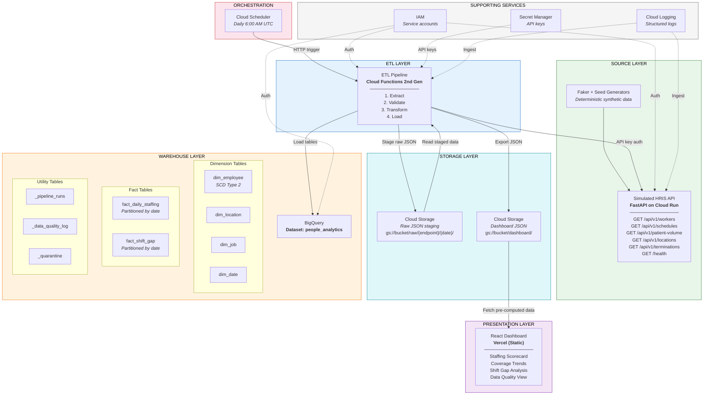

# Architecture Document

## WellNow Staffing Analytics -- People Analytics Data Pipeline POC

**Project:** Multi-Location Workforce Staffing & Coverage Optimization
**Organization:** WellNow Urgent Care (TAG -- The Aspen Group)
**Version:** 1.0
**Last Updated:** February 22, 2026

---

## Table of Contents

1. [System Architecture Overview](#1-system-architecture-overview)
2. [Component Interaction Details](#2-component-interaction-details)
3. [Data Flow](#3-data-flow)
4. [Technology Choices and Rationale](#4-technology-choices-and-rationale)
5. [Deployment Topology](#5-deployment-topology)
6. [Error Handling Strategy](#6-error-handling-strategy)
7. [Scaling to Production: What Changes at TAG Scale](#7-scaling-to-production-what-changes-at-tag-scale)

---

## 1. System Architecture Overview

This system implements an end-to-end People Analytics data pipeline that ingests simulated HRIS workforce data, transforms it into an analytics-ready star schema, and serves staffing intelligence through an interactive dashboard. The architecture models the exact infrastructure required for WellNow Urgent Care's multi-location staffing optimization across ~80 clinic locations and ~1,200 employees.

### Architecture Diagram



### Component Summary

| Component | GCP Service | Purpose | Free Tier Coverage |
|---|---|---|---|
| Simulated HRIS API | Cloud Run | REST API returning realistic staffing data | 2M requests/month |
| ETL Pipeline | Cloud Functions (2nd Gen) | Extract, validate, transform, load | 2M invocations/month |
| Scheduler | Cloud Scheduler | Trigger daily pipeline runs at 6 AM UTC | 3 jobs/month |
| Data Warehouse | BigQuery | Star-schema analytics warehouse | 10 GB storage, 1 TB queries/month |
| Staging Bucket | Cloud Storage | Temporary raw JSON staging | 5 GB |
| Dashboard JSON | Cloud Storage | Pre-computed analytics JSON for dashboard | 5 GB (shared) |
| Dashboard | Vercel | Interactive portfolio and staffing analytics | Free tier (static) |
| Source Control | GitHub | Version-controlled, documented repository | Free |

---

## 2. Component Interaction Details

### 2.1 Simulated HRIS API (FastAPI on Cloud Run)

The API simulates the workforce and operational data sources that would exist in TAG's production environment (Workday HRIS, scheduling/timekeeping system, patient volume reporting). It generates realistic multi-location urgent care staffing data using deterministic seed-based Faker generators.

**Endpoints:**

| Endpoint | Method | Description | Query Parameters |
|---|---|---|---|
| `/api/v1/workers` | GET | Paginated employee/clinician records | `page`, `page_size`, `location_id`, `role_type` |
| `/api/v1/workers/{employee_id}` | GET | Single employee detail | -- |
| `/api/v1/schedules` | GET | Scheduled and actual shift data | `start_date`, `end_date`, `location_id` |
| `/api/v1/patient-volume` | GET | Daily patient visit counts by location | `start_date`, `end_date`, `location_id` |
| `/api/v1/locations` | GET | Location master data (all clinics) | -- |
| `/api/v1/terminations` | GET | Termination records within date range | `start_date`, `end_date` |
| `/health` | GET | Health check / readiness probe | -- |

**Authentication:** API key via `X-API-Key` header, validated on every request. Key stored in Secret Manager and injected as an environment variable at deploy time.

**Data Generation Characteristics:**

- ~80 urgent care clinic locations across 15 states, ~1,200 employees
- Role types: Provider (MD/DO/PA/NP), RN, Medical Assistant, Radiology Tech, Office Manager, Front Desk
- Referential integrity: every employee maps to a valid location; every `manager_id` maps to a valid employee
- Realistic distributions: ~22% annual attrition for support staff, ~12% for providers; seasonal patient volume patterns; day-of-week demand curves
- 18 months of historical daily scheduling and patient volume data
- Seed-based reproducibility for consistent demos and testing

### 2.2 ETL Pipeline (Cloud Functions 2nd Gen)

The pipeline is structured as four sequential stages, each with clearly defined responsibilities.

#### Stage 1: Extract

```
HRIS API  --->  Raw JSON  --->  Cloud Storage (staging)
```

- Authenticates with the HRIS API using the API key from Secret Manager
- Paginates through all five data endpoints with configurable `page_size` (default: 500)
- Implements exponential backoff for rate limiting (max 3 retries, base delay 1 second)
- Handles API errors gracefully: timeouts, HTTP 5xx, malformed responses
- Stages raw JSON responses to Cloud Storage as timestamped files:
  `gs://{bucket}/raw/{endpoint}/{YYYY-MM-DD}/{timestamp}.json`
- Logs extraction metrics: `records_fetched`, `duration_ms`, `errors`, `bytes`
- Supports both full and incremental extraction modes

#### Stage 2: Validate

```
Raw JSON  --->  Pydantic Schema Validation  --->  Valid Records + Quarantined Records
```

- Schema validation using strict-mode Pydantic models
- Executes 15 data quality rules covering:
  - Null checks on required fields
  - Referential integrity (location_key exists, manager_id valid)
  - Range validation (hours >= 0, patient_visits >= 0, coverage_score within bounds)
  - Duplicate detection (composite key uniqueness)
- Invalid records are flagged but NOT dropped -- they are routed to the `_quarantine` table with error context
- Generates a structured DQ report: pass/fail counts per rule, per table
- Writes validation results to `_data_quality_log` in BigQuery

#### Stage 3: Transform

```
Validated Records  --->  Derived Fields + Aggregation  --->  Dimension & Fact Models
```

- Flattens nested JSON into tabular format
- Derives calculated fields:

| Derived Field | Formula |
|---|---|
| `coverage_score` | `actual_provider_hours / required_provider_hours` |
| `patients_per_provider_hour` | `patient_visits / actual_provider_hours` |
| `labor_cost_per_visit` | `total_labor_cost / patient_visits` |
| `overtime_rate` | `overtime_hours / total_hours_worked` |
| `gap_flag` | `TRUE when actual_providers < required_providers` |
| `excess_flag` | `TRUE when actual_providers > required_providers * 1.15` |
| `staffing_classification` | Categorical: Chronically Understaffed / Needs Attention / Optimally Staffed / Potentially Overstaffed |
| `tenure_band` | Categorical: 0-1yr, 1-3yr, 3-5yr, 5-10yr, 10+yr |
| `is_new_hire` | `TRUE when hired within last 90 days` |

- Standardizes fields: title case names, ISO dates, consistent enum values
- Builds SCD Type 2 history for `dim_employee` tracking job and location changes
- Aggregates shift-level data into `fact_daily_staffing`
- Detects shift gaps and populates `fact_shift_gap`

#### Stage 4: Load

```
Transformed DataFrames  --->  BigQuery Load Jobs  --->  Dashboard JSON Export
```

- Writes to BigQuery using load jobs (not streaming, for cost optimization)
- Dimension tables: `WRITE_TRUNCATE` (full refresh)
- Fact tables: `WRITE_APPEND` (incremental)
- Partitions fact tables by `snapshot_date` for query performance and cost
- Clusters dimension tables by `location_key` and `role_type`
- Updates `_pipeline_runs` metadata table with run audit trail
- Exports dashboard-ready JSON to Cloud Storage for the presentation layer
- Logs load metrics: `rows_loaded`, `duration`, `bytes_written`

### 2.3 BigQuery Data Warehouse

The warehouse uses a star schema design within the `people_analytics` dataset.

**Dimension Tables (4):**

| Table | Description | Key Fields | Clustering |
|---|---|---|---|
| `dim_employee` | Employee master with SCD Type 2 history | `employee_key` (surrogate), `employee_id` (natural), `role_type`, `status`, `location_key`, `tenure_band` | `location_key, role_type, status` |
| `dim_location` | Clinic location master data | `location_key`, `location_id`, `region`, `state`, `location_type`, `budgeted_provider_fte` | `region, state` |
| `dim_job` | Job title and role classification | `job_key`, `job_title`, `role_type`, `is_clinical`, `is_provider` | -- |
| `dim_date` | Calendar dimension | `date_key` (YYYYMMDD), `full_date`, `day_name`, `is_weekend`, `fiscal_year` | -- |

**Fact Tables (2):**

| Table | Description | Grain | Partitioning | Clustering |
|---|---|---|---|---|
| `fact_daily_staffing` | Core staffing metrics per location per day | One row per location per day | `snapshot_date` | `location_key` |
| `fact_shift_gap` | Shift-level understaffing/overstaffing detection | One row per location per shift window per day | `snapshot_date` | `location_key, shift_window` |

**Utility Tables (3):**

| Table | Purpose |
|---|---|
| `_pipeline_runs` | Pipeline execution audit trail: run_id, status, record counts, duration, errors |
| `_data_quality_log` | Data quality check results: rule name, pass/fail counts, severity, status |
| `_quarantine` | Rejected records with original JSON, failure rule, and failure reason |

### 2.4 React Dashboard (Vercel)

The dashboard reads pre-computed JSON files from Cloud Storage rather than querying BigQuery directly. This design eliminates the need for a backend API for the dashboard, keeps query costs at zero, and allows static hosting on Vercel's free tier.

**Dashboard Sections:**

| Section | Purpose |
|---|---|
| Hero / Landing | Project overview and candidate positioning |
| Architecture Deep Dive | Interactive system architecture walkthrough |
| Staffing Dashboard | Location scorecards, coverage trends, shift gap analysis, overtime hotspots |
| Data Quality + SQL Showcase | Pipeline health metrics, DQ pass rates, featured SQL queries |

---

## 3. Data Flow

### End-to-End Flow: Source to Dashboard

```
                    STAGE 1              STAGE 2              STAGE 3              STAGE 4
                   EXTRACT              VALIDATE            TRANSFORM              LOAD

 +-----------+    +---------+    +---------------+    +---------------+    +-------------+
 | HRIS API  |--->| Raw JSON|--->| Pydantic      |--->| Derived fields|--->| BigQuery    |
 | (FastAPI) |    | on GCS  |    | Schema Check  |    | Aggregation   |    | Load Jobs   |
 +-----------+    +---------+    +-------+-------+    | Star Schema   |    +------+------+
                                         |            +---------------+           |
                                         v                                        v
                                  +------+------+                         +-------+-------+
                                  | _quarantine |                         | Dashboard JSON|
                                  | (BigQuery)  |                         | on GCS        |
                                  +-------------+                         +-------+-------+
                                                                                  |
                                                                                  v
                                                                          +-------+-------+
                                                                          | React Dashboard|
                                                                          | (Vercel)       |
                                                                          +----------------+
```

### Detailed Data Flow Table

| Step | Source | Destination | Format | Transport | Frequency |
|---|---|---|---|---|---|
| 1. Generate | Faker generators | API response | JSON | In-memory | On-demand |
| 2. Extract | HRIS API endpoints | Cloud Storage (raw/) | JSON files | HTTPS + API key | Daily 6 AM UTC |
| 3. Stage | Cloud Storage (raw/) | ETL pipeline memory | JSON -> pandas DataFrame | GCS client | Daily |
| 4. Validate | DataFrames | Valid set + _quarantine | DataFrame + BigQuery rows | In-memory + BQ load | Daily |
| 5. Transform | Valid DataFrames | Star schema DataFrames | pandas DataFrames | In-memory | Daily |
| 6. Load dims | Dimension DataFrames | BigQuery dim_* tables | Parquet (via load job) | BQ client (WRITE_TRUNCATE) | Daily |
| 7. Load facts | Fact DataFrames | BigQuery fact_* tables | Parquet (via load job) | BQ client (WRITE_APPEND) | Daily |
| 8. Audit | Pipeline metrics | _pipeline_runs, _data_quality_log | BigQuery rows | BQ client | Daily |
| 9. Export | BigQuery query results | Cloud Storage (dashboard/) | JSON files | GCS client | Daily (post-load) |
| 10. Serve | Cloud Storage (dashboard/) | React dashboard | JSON via HTTPS | Static fetch | On page load |

### Staging Bucket Structure

```
gs://{staging-bucket}/
  raw/
    workers/
      2026-02-22/
        1708588800_page1.json
        1708588801_page2.json
    schedules/
      2026-02-22/
        1708588810.json
    patient-volume/
      2026-02-22/
        1708588820.json
    locations/
      2026-02-22/
        1708588830.json
    terminations/
      2026-02-22/
        1708588840.json

gs://{dashboard-bucket}/
  dashboard/
    staffing_scorecard.json
    coverage_trends.json
    shift_gap_analysis.json
    overtime_hotspots.json
    data_quality_summary.json
    pipeline_health.json
```

---

## 4. Technology Choices and Rationale

### Backend and Data Engineering

| Technology | Version | Component | Rationale |
|---|---|---|---|
| **Python** | 3.11+ | API, ETL | Industry standard for data engineering; strong ecosystem for GCP integrations; async support in 3.11+ improves API throughput |
| **FastAPI** | Latest | HRIS API | Async request handling for high throughput; automatic OpenAPI/Swagger documentation; Pydantic-native request/response validation; significantly faster than Flask for API workloads |
| **Faker** | Latest | Data generation | Generates realistic synthetic data (names, addresses, dates) with locale support; seed-based determinism ensures reproducible outputs across environments |
| **Pydantic** | v2 | Validation | Strict-mode schema validation catches type errors at the boundary; reusable models across API response parsing and ETL validation; native FastAPI integration |
| **pandas** | Latest | ETL transforms | Efficient tabular data manipulation for derive, aggregate, and reshape operations; well-understood by analytics teams; sufficient for POC data volumes (~80 locations, 18 months) |
| **google-cloud-bigquery** | Latest | Warehouse loading | Official GCP client with load job support (cost-optimal vs. streaming inserts); handles partitioning, clustering, and schema management; free tier compatible |
| **google-cloud-storage** | Latest | Staging | Official GCS client for raw data staging and dashboard JSON export |
| **requests** | Latest | API extraction | Simple HTTP client for API calls; pairs with custom retry/backoff logic |

### Frontend

| Technology | Version | Component | Rationale |
|---|---|---|---|
| **React** | 18 | Dashboard UI | Component-based architecture for reusable chart widgets; large ecosystem; industry standard for data dashboards |
| **Vite** | Latest | Build tooling | Sub-second hot module replacement during development; optimized production builds with tree shaking; faster than Create React App |
| **Tailwind CSS** | Latest | Styling | Utility-first CSS eliminates context switching; consistent design system; small production bundle via PurgeCSS |
| **Recharts** | Latest | Data visualization | React-native charting library; declarative API matches React patterns; supports responsive charts, tooltips, and animations out of the box |

### Infrastructure

| Technology | Component | Rationale |
|---|---|---|
| **Cloud Run** | API hosting | Scales to zero when idle (zero cost between pipeline runs); container-based deployment; managed TLS and load balancing |
| **Cloud Functions 2nd Gen** | ETL execution | Event-driven invocation via Cloud Scheduler; up to 60-minute timeout (sufficient for full pipeline run); no server management |
| **Cloud Scheduler** | Orchestration | Managed cron service; 3 free jobs/month; integrates natively with Cloud Functions via HTTP trigger |
| **BigQuery** | Data warehouse | Columnar storage optimized for analytical queries; native partitioning and clustering; 10 GB free storage and 1 TB free queries/month; the data warehouse TAG uses in production |
| **Cloud Storage** | Staging and export | Durable object storage for raw data staging and dashboard JSON; 5 GB free tier; lifecycle policies for automatic cleanup |
| **Secret Manager** | Credentials | Secure storage for API keys; IAM-controlled access; audit logging of secret access |
| **Cloud Logging** | Observability | Centralized structured logging from Cloud Run and Cloud Functions; query and alerting capabilities |
| **IAM** | Access control | Service account-based authentication between components; principle of least privilege |
| **Vercel** | Dashboard hosting | Free static site hosting; global CDN; automatic deployments from GitHub |

---

## 5. Deployment Topology

### Environment Layout

All services operate within the GCP free tier, targeting a monthly cost of $0.

```
+-------------------------------------------------------------------+
|                     GCP Project: wellnow-analytics                 |
|                                                                    |
|  +---------------------------+  +------------------------------+  |
|  | Cloud Run                 |  | Cloud Functions (2nd Gen)    |  |
|  | Service: hris-api         |  | Function: etl-pipeline       |  |
|  | Region: us-central1       |  | Region: us-central1          |  |
|  | Max instances: 1          |  | Trigger: HTTP (from Sched.)  |  |
|  | Min instances: 0          |  | Memory: 512 MB               |  |
|  | Memory: 256 MB            |  | Timeout: 540 seconds         |  |
|  | CPU: 1                    |  | Max instances: 1             |  |
|  | Concurrency: 80           |  +------------------------------+  |
|  +---------------------------+                                     |
|                                                                    |
|  +---------------------------+  +------------------------------+  |
|  | Cloud Scheduler           |  | BigQuery                     |  |
|  | Job: daily-etl-trigger    |  | Dataset: people_analytics    |  |
|  | Schedule: 0 6 * * *       |  | Region: US (multi-region)    |  |
|  | Target: HTTP -> Cloud Fn  |  | 9 tables (4 dim, 2 fact,     |  |
|  | Timezone: UTC              |  |   3 utility)                 |  |
|  +---------------------------+  +------------------------------+  |
|                                                                    |
|  +---------------------------+  +------------------------------+  |
|  | Cloud Storage             |  | Secret Manager               |  |
|  | Bucket: staging           |  | Secret: hris-api-key         |  |
|  | Bucket: dashboard         |  | Secret: gcp-project-id       |  |
|  | Region: us-central1       |  +------------------------------+  |
|  | Lifecycle: 30-day expiry  |                                    |
|  +---------------------------+  +------------------------------+  |
|                                 | Cloud Logging                |  |
|                                 | Log sink: etl-pipeline       |  |
|                                 | Log sink: hris-api           |  |
|                                 +------------------------------+  |
+-------------------------------------------------------------------+

+-------------------------------------------------------------------+
|                     Vercel (External)                               |
|                                                                    |
|  +-------------------------------------------------------------+  |
|  | Static Site: wellnow-staffing-analytics                      |  |
|  | Framework: React 18 + Vite                                   |  |
|  | Deploy source: GitHub (auto-deploy on push to main)          |  |
|  | CDN: Global edge network                                     |  |
|  | Data source: Cloud Storage (dashboard/) via public URL       |  |
|  +-------------------------------------------------------------+  |
+-------------------------------------------------------------------+
```

### Service Configuration Details

**Cloud Run -- HRIS API:**

| Setting | Value | Rationale |
|---|---|---|
| Max instances | 1 | Free tier limit; sufficient for daily pipeline extraction |
| Min instances | 0 | Scale to zero between runs; zero cost when idle |
| Memory | 256 MB | Sufficient for Faker data generation in-memory |
| CPU | 1 vCPU | Adequate for JSON serialization workload |
| Concurrency | 80 | Default; handles paginated extraction from single ETL client |
| Container port | 8080 | FastAPI default with uvicorn |
| Startup probe | GET /health | Ensures readiness before receiving traffic |

**Cloud Functions 2nd Gen -- ETL Pipeline:**

| Setting | Value | Rationale |
|---|---|---|
| Trigger | HTTP | Invoked by Cloud Scheduler; supports manual re-runs |
| Memory | 512 MB | Accommodates pandas DataFrames for full dataset in memory |
| Timeout | 540 seconds (9 min) | Full pipeline completes in ~3-5 minutes; buffer for retries |
| Max instances | 1 | Prevents concurrent pipeline runs; ensures data consistency |
| Service account | etl-pipeline-sa | Scoped permissions: BQ write, GCS read/write, Secret access |

**Cloud Scheduler:**

| Setting | Value | Rationale |
|---|---|---|
| Schedule | `0 6 * * *` (daily 6 AM UTC) | Pre-business-hours refresh; data ready by 7 AM ET |
| Target | HTTP POST to Cloud Function URL | Native integration |
| Retry config | 3 retries, 5-minute backoff | Handles transient Cloud Function cold starts |

### Cost Analysis

| Service | Free Tier Allocation | POC Usage (estimated) | Monthly Cost |
|---|---|---|---|
| Cloud Run | 2M requests, 360K vCPU-seconds | ~500 requests/day (pipeline extraction) | $0 |
| Cloud Functions | 2M invocations, 400K GB-seconds | 1 invocation/day | $0 |
| Cloud Scheduler | 3 jobs | 1 job | $0 |
| BigQuery Storage | 10 GB | ~200 MB (9 tables, 18 months) | $0 |
| BigQuery Queries | 1 TB/month | ~5 GB/month (dashboard exports) | $0 |
| Cloud Storage | 5 GB | ~500 MB (raw staging + dashboard JSON) | $0 |
| Secret Manager | 6 active versions, 10K access ops | 2 secrets, ~30 accesses/day | $0 |
| Cloud Logging | 50 GB/month | ~100 MB/month | $0 |
| Vercel | 100 GB bandwidth | ~1 GB/month | $0 |
| **Total** | | | **$0/month** |

---

## 6. Error Handling Strategy

### 6.1 API Layer (Extract)

**Retry with Exponential Backoff:**

```
Attempt 1: Immediate request
  |-- On failure (timeout, 5xx, connection error) -->
Attempt 2: Wait 1 second, retry
  |-- On failure -->
Attempt 3: Wait 2 seconds, retry
  |-- On failure -->
Attempt 4: Wait 4 seconds, retry
  |-- On failure -->
FAIL: Log error, record in _pipeline_runs, halt pipeline
```

**Handled Error Types:**

| Error Type | HTTP Status | Behavior |
|---|---|---|
| Rate limit | 429 | Respect `Retry-After` header; backoff and retry |
| Server error | 500, 502, 503, 504 | Exponential backoff; max 3 retries |
| Timeout | -- | Configurable timeout (30s default); retry on timeout |
| Authentication | 401, 403 | Fail immediately; do not retry (configuration error) |
| Not found | 404 | Log warning; skip endpoint; continue pipeline |
| Malformed response | -- | Catch JSON decode errors; log raw response; fail extraction for that endpoint |

**Structured Error Responses from API:**

```json
{
  "error": {
    "code": "VALIDATION_ERROR",
    "message": "Invalid date range: start_date must be before end_date",
    "details": {
      "field": "start_date",
      "value": "2026-03-01",
      "constraint": "must be before end_date (2026-01-01)"
    },
    "request_id": "req-abc123",
    "timestamp": "2026-02-22T06:00:15Z"
  }
}
```

### 6.2 ETL Layer (Validate, Transform, Load)

**Quarantine Pattern for Failed Records:**

Records that fail validation are not dropped. They are written to the `_quarantine` table with full error context, allowing data engineers to investigate and remediate without data loss.

```
Incoming Record
    |
    v
[Pydantic Schema Check] --FAIL--> _quarantine table
    |                              (record_json, failure_rule_id,
    |PASS                          failure_reason, batch_id)
    v
[DQ Rule Checks] ----------FAIL--> _quarantine table
    |
    |PASS
    v
[Transform + Load]
```

**Pipeline Run Audit Trail:**

Every pipeline execution writes a record to `_pipeline_runs`:

| Field | Description |
|---|---|
| `run_id` | Unique identifier for the run (UUID) |
| `pipeline_name` | Pipeline identifier |
| `started_at` | Execution start timestamp |
| `completed_at` | Execution end timestamp |
| `status` | Success, Failed, or Partial |
| `records_extracted` | Total records pulled from API |
| `records_validated` | Records passing all validation rules |
| `records_quarantined` | Records routed to quarantine |
| `records_loaded` | Records successfully written to warehouse |
| `error_message` | Error details if status is Failed |
| `run_duration_seconds` | Wall-clock execution time |

**Pipeline Failure Modes:**

| Failure Scenario | Impact | Resolution |
|---|---|---|
| API unreachable after retries | Pipeline halts; no partial data written | Logged as Failed in _pipeline_runs; Cloud Scheduler retries next day; manual re-run available |
| >15% records fail validation | Pipeline continues with warning; valid records loaded | High-severity alert in _data_quality_log; quarantined records available for inspection |
| BigQuery load job fails | Transaction rolled back for affected table | Error logged; dimension tables retain previous day's data; facts skip the day |
| Cloud Storage write fails | Dashboard shows stale data | Logged; dashboard displays last-updated timestamp; graceful fallback |

### 6.3 Dashboard Layer (Presentation)

**Graceful Degradation:**

| Scenario | User Experience |
|---|---|
| JSON files unavailable (GCS down) | Dashboard displays "Data temporarily unavailable" with last-known-good timestamp |
| Stale data (pipeline did not run) | Dashboard shows data with "Last updated: [timestamp]" indicator; visual cue when data is >24 hours old |
| Partial data (some JSON files missing) | Available sections render normally; unavailable sections show placeholder with explanation |
| Network error on fetch | Client-side retry (3 attempts); fallback to cached data if available in browser storage |

---

## 7. Scaling to Production: What Changes at TAG Scale

This POC models 80 WellNow locations with ~1,200 employees. TAG operates 1,400+ locations across 5 brands with 15,000+ employees. The following table maps each POC component to its production-scale equivalent.

### Component Evolution

| Component | POC (Current) | Production (TAG Scale) | Why the Change |
|---|---|---|---|
| **Data Source** | Faker-generated synthetic data via FastAPI | Real Workday HRIS integration, ADP timekeeping, athenahealth scheduling | Synthetic data demonstrates the pipeline; production requires real source system connectors with CDC (Change Data Capture) |
| **Ingestion Pattern** | Daily batch extraction (Cloud Scheduler + HTTP) | Streaming via Pub/Sub for real-time staffing events; batch for nightly full syncs | 1,400 locations require real-time gap detection; daily batch is too slow for same-day float deployment decisions |
| **ETL Framework** | pandas in Cloud Functions | Apache Beam on Dataflow or dbt on BigQuery | pandas does not scale beyond ~10 GB in memory; Dataflow provides distributed processing; dbt provides version-controlled SQL transformations with testing and documentation |
| **Transformation Layer** | Python-based transforms in custom pipeline code | dbt (data build tool) with modular SQL models, tests, and documentation | dbt is the industry standard for analytics engineering; provides lineage, testing, incremental models, and collaboration features that raw Python cannot match at scale |
| **Data Warehouse** | BigQuery with manual schema management | BigQuery with row-level security (RLS), column-level encryption, materialized views | Multi-brand access requires RLS so WellNow analysts cannot see Aspen Dental data; HIPAA compliance requires column-level encryption for PII |
| **Access Control** | Single service account, shared dataset | IAM with row-level security, data masking, authorized views | Regional directors should see only their region; executives see all; PII fields masked for non-HR users |
| **Infrastructure Management** | Shell scripts for deployment | Terraform for Infrastructure as Code (IaC) | Reproducible, version-controlled infrastructure; drift detection; multi-environment support; required for SOX/SOC2 compliance |
| **Environments** | Single environment (production) | dev / staging / prod with promotion pipeline | Isolated testing; prevents untested changes from reaching production data |
| **Orchestration** | Cloud Scheduler (single daily trigger) | Cloud Composer (managed Airflow) or Prefect | Complex DAG dependencies: multiple source systems, conditional logic, SLA monitoring, failure alerting, backfill support |
| **Monitoring** | Cloud Logging + _pipeline_runs table | Datadog or Grafana with alerting, SLA dashboards, anomaly detection | Operations teams need real-time visibility into pipeline health across hundreds of daily runs |
| **Dashboard** | Static JSON from Cloud Storage | Looker or Tableau connected directly to BigQuery with row-level security | Self-service analytics for 50+ stakeholders; parameterized reports; scheduled email delivery; embedded analytics in operational tools |
| **CI/CD** | Manual deployment scripts | GitHub Actions with automated testing, linting, security scanning, staged rollout | Production data pipelines require automated quality gates before deployment |
| **Data Quality** | 15 validation rules in Python | Great Expectations or dbt tests with automated alerting and SLA tracking | 1,400 locations generate edge cases that require hundreds of validation rules; anomaly detection for data drift |
| **Security** | API key authentication | OAuth 2.0, VPC Service Controls, CMEK encryption, audit logging | HIPAA, SOX, and SOC2 compliance requirements for healthcare workforce data |

### Architecture at TAG Scale

```
                        TAG Production Architecture (Conceptual)

   +----------------+     +---------------+     +-------------------+
   | Workday HRIS   |---->|               |     |                   |
   +----------------+     |   Pub/Sub     |---->|   Dataflow        |
   | ADP Timekeeping|---->|   (Streaming) |     |   (Apache Beam)   |
   +----------------+     |               |     |                   |
   | athenahealth   |---->+---------------+     +--------+----------+
   +----------------+                                    |
                                                         v
   +----------------+     +---------------+     +--------+----------+
   | Terraform      |     | Cloud         |     | BigQuery          |
   | (IaC)          |     | Composer      |     | + Row-Level Sec.  |
   +----------------+     | (Airflow)     |     | + dbt Models      |
                          +---------------+     | + Materialized Vw |
                                                +--------+----------+
   +----------------+     +---------------+              |
   | GitHub Actions |     | Datadog       |     +--------+----------+
   | (CI/CD)        |     | (Monitoring)  |     | Looker / Tableau  |
   +----------------+     +---------------+     | (Self-Service BI) |
                                                +-------------------+
```

### Key Differences Summarized

1. **Data sources:** Faker API replaced by real Workday/HRIS integrations with CDC connectors
2. **Real-time:** Add Pub/Sub streaming for real-time staffing event processing alongside daily batch
3. **Security:** BigQuery row-level security, column-level encryption, VPC Service Controls for HIPAA compliance
4. **Transformation:** dbt replaces custom Python transforms for testability, documentation, and team collaboration
5. **Infrastructure:** Terraform for IaC with version control, drift detection, and multi-environment promotion
6. **Environments:** dev/staging/prod isolation with automated promotion pipeline
7. **Orchestration:** Cloud Composer (Airflow) for complex DAG management with SLA monitoring
8. **Monitoring:** Datadog or Grafana with proactive alerting, anomaly detection, and SLA dashboards

---

*This document describes the architecture of a proof-of-concept system. It is designed to demonstrate production-grade data engineering patterns at POC scale while identifying the specific changes required for TAG's 1,400+ location production environment.*
