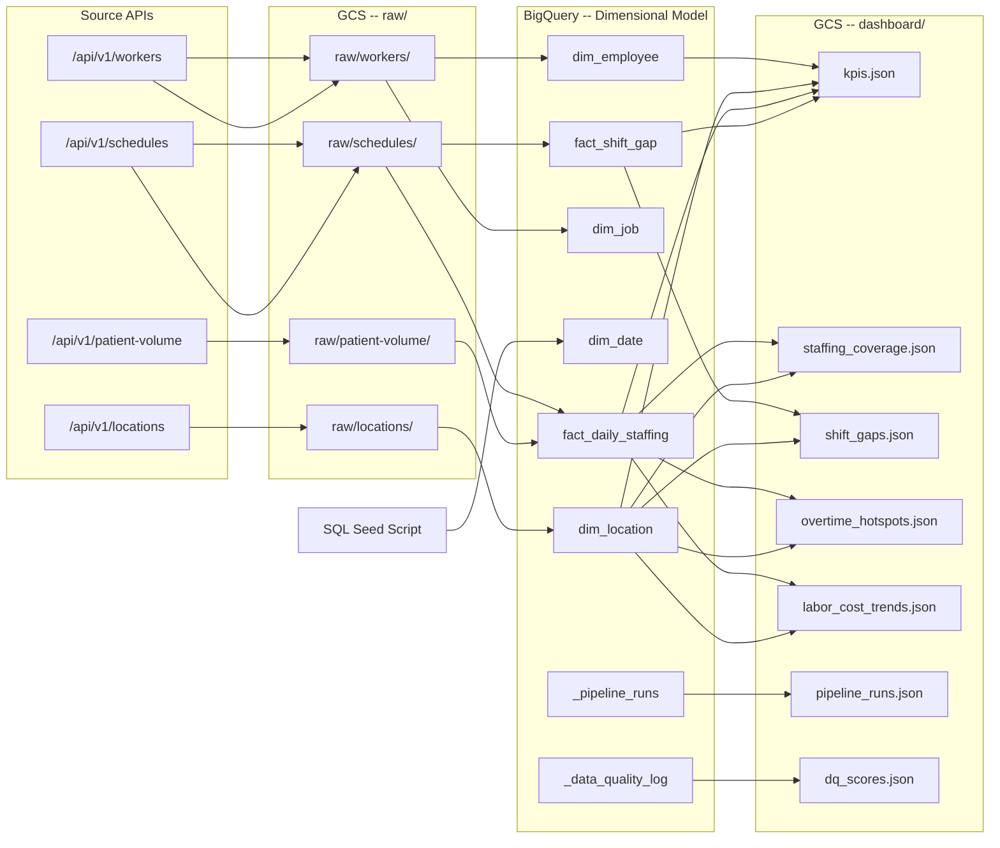
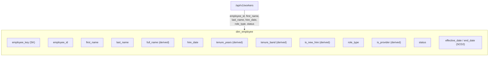
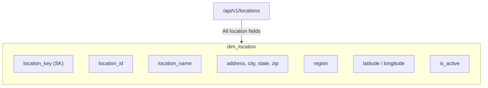
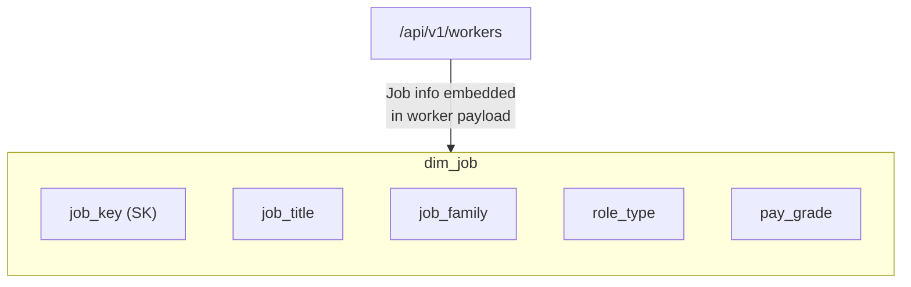
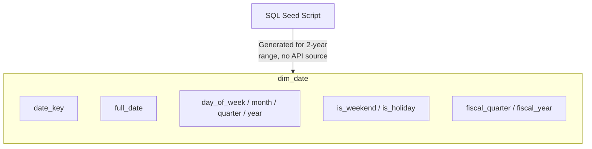
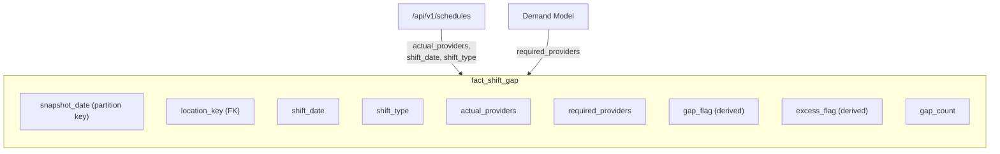
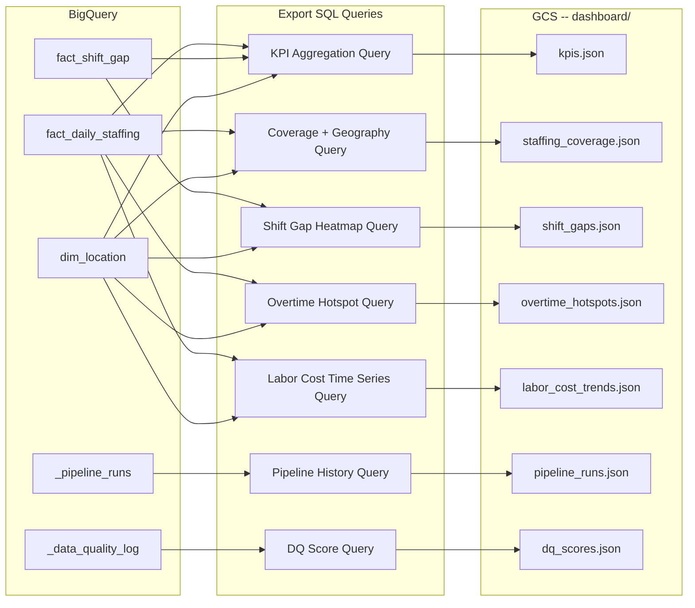
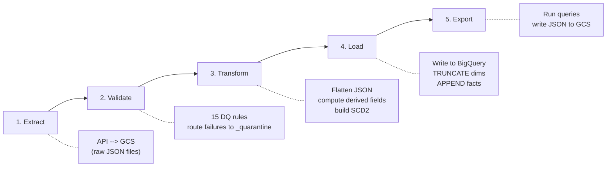

# Data Lineage -- WellNow Staffing Analytics

This document traces the complete data lineage from source APIs through cloud storage, BigQuery dimensional tables, and finally to the dashboard JSON files consumed by the frontend. Every computed field is documented with its formula, upstream inputs, and originating source.

---

## Table of Contents

1. [Source-to-Target Mapping](#1-source-to-target-mapping)
2. [Dashboard JSON Mapping](#2-dashboard-json-mapping)
3. [Derived Field Lineage](#3-derived-field-lineage)
4. [Data Freshness Expectations](#4-data-freshness-expectations)
5. [ETL Stage Mapping](#5-etl-stage-mapping)

---

## 1. Source-to-Target Mapping

### 1.1 End-to-End Flow (API to Dashboard)



### 1.2 Dimension Tables -- Source Mapping









### 1.3 Fact Tables -- Source Mapping

```mermaid
flowchart TD
    subgraph fact_daily_staffing
        direction TB
        E1["snapshot_date (partition key)"]
        E2["location_key (FK)"]
        E3["actual_provider_hours"]
        E4["required_provider_hours"]
        E5["patient_visits"]
        E6["overtime_hours"]
        E7["total_hours_worked"]
        E8["labor_cost_total"]
        E9["coverage_score (derived)"]
        E10["patients_per_provider_hour (derived)"]
        E11["labor_cost_per_visit (derived)"]
        E12["overtime_rate (derived)"]
    end

    S1["/api/v1/schedules"] -->|actual_provider_hours,\nrequired_provider_hours,\novertime_hours, total_hours_worked| fact_daily_staffing
    PV1["/api/v1/patient-volume"] -->|patient_visits| fact_daily_staffing
    DM["Demand Model"] -->|required_provider_hours\n(baseline)| fact_daily_staffing
```



---

## 2. Dashboard JSON Mapping

Each dashboard JSON file is produced by a SQL query that joins BigQuery tables and writes the result to GCS as a JSON file. The export step runs after every successful ETL pipeline execution.

### 2.1 JSON File to Source Table Matrix

| JSON File | Primary Source Table(s) | Join Table(s) | Content Description |
|---|---|---|---|
| `kpis.json` | `fact_daily_staffing`, `fact_shift_gap` | `dim_location` | Aggregated KPI metrics across all locations |
| `staffing_coverage.json` | `fact_daily_staffing` | `dim_location` | Geographic coverage data with lat/lng coordinates |
| `shift_gaps.json` | `fact_shift_gap` | `dim_location` | Heatmap data -- gap counts by location and shift type |
| `overtime_hotspots.json` | `fact_daily_staffing` | `dim_location` | Overtime analysis by location with hotspot flagging |
| `labor_cost_trends.json` | `fact_daily_staffing` | `dim_location` | Time series of labor cost metrics grouped by region |
| `pipeline_runs.json` | `_pipeline_runs` | -- | ETL run history with status, duration, record counts |
| `dq_scores.json` | `_data_quality_log` | -- | Data quality rule results per pipeline run |

### 2.2 Detailed JSON Lineage



#### kpis.json

Aggregates high-level metrics from both fact tables joined to `dim_location` for regional rollups.

**Fields produced:**
- `total_locations` -- COUNT DISTINCT of active locations
- `avg_coverage_score` -- AVG(`coverage_score`) from `fact_daily_staffing`
- `total_gap_shifts` -- SUM(`gap_flag`) from `fact_shift_gap`
- `avg_overtime_rate` -- AVG(`overtime_rate`) from `fact_daily_staffing`
- `avg_patients_per_provider_hour` -- AVG(`patients_per_provider_hour`)
- `avg_labor_cost_per_visit` -- AVG(`labor_cost_per_visit`)

#### staffing_coverage.json

Joins `fact_daily_staffing` to `dim_location` for geographic coverage visualization.

**Fields produced:**
- `location_id`, `location_name`, `latitude`, `longitude`, `region`, `state`
- `coverage_score` -- most recent day's coverage
- `staffing_classification` -- derived from rolling `coverage_score`
- `actual_provider_hours`, `required_provider_hours`

#### shift_gaps.json

Joins `fact_shift_gap` to `dim_location` to produce heatmap data.

**Fields produced:**
- `location_id`, `location_name`, `region`
- `shift_date`, `shift_type`
- `actual_providers`, `required_providers`
- `gap_flag`, `excess_flag`, `gap_count`

#### overtime_hotspots.json

Joins `fact_daily_staffing` to `dim_location` for overtime analysis.

**Fields produced:**
- `location_id`, `location_name`, `region`, `state`
- `overtime_hours`, `total_hours_worked`, `overtime_rate`
- `labor_cost_total`

#### labor_cost_trends.json

Joins `fact_daily_staffing` to `dim_location` for time-series data grouped by region.

**Fields produced:**
- `region`, `snapshot_date`
- `labor_cost_total` (summed by region and date)
- `labor_cost_per_visit` (averaged by region and date)
- `patient_visits` (summed by region and date)

#### pipeline_runs.json

Direct read from the `_pipeline_runs` metadata table.

**Fields produced:**
- `run_id`, `run_start`, `run_end`, `status`
- `records_extracted`, `records_loaded`, `records_quarantined`
- `duration_seconds`

#### dq_scores.json

Direct read from the `_data_quality_log` metadata table.

**Fields produced:**
- `run_id`, `rule_name`, `table_name`
- `records_checked`, `records_passed`, `records_failed`
- `pass_rate`, `check_timestamp`

---

## 3. Derived Field Lineage

Every computed field in the pipeline is documented below with its formula, the table it resides in, and the upstream data sources that feed its inputs.

### 3.1 Fact Table Derived Fields

#### coverage_score

| Attribute | Detail |
|---|---|
| **Table** | `fact_daily_staffing` |
| **Formula** | `actual_provider_hours / required_provider_hours` |
| **Input: actual_provider_hours** | Extracted from `/api/v1/schedules` -- sum of scheduled provider hours for the day |
| **Input: required_provider_hours** | Derived from demand model baseline applied to `/api/v1/schedules` requirements |
| **Type** | FLOAT64 |
| **Range** | 0.0 to 2.0+ (values above 1.0 indicate overstaffing) |
| **Null Handling** | NULL if `required_provider_hours` is 0 or NULL |

#### patients_per_provider_hour

| Attribute | Detail |
|---|---|
| **Table** | `fact_daily_staffing` |
| **Formula** | `patient_visits / actual_provider_hours` |
| **Input: patient_visits** | Extracted from `/api/v1/patient-volume` -- daily visit count per location |
| **Input: actual_provider_hours** | Extracted from `/api/v1/schedules` -- sum of actual provider hours worked |
| **Type** | FLOAT64 |
| **Null Handling** | NULL if `actual_provider_hours` is 0 or NULL |

#### labor_cost_per_visit

| Attribute | Detail |
|---|---|
| **Table** | `fact_daily_staffing` |
| **Formula** | `labor_cost_total / patient_visits` |
| **Input: labor_cost_total** | Derived field: `total_hours_worked * hourly_rate` (rates sourced from worker pay information) |
| **Input: patient_visits** | Extracted from `/api/v1/patient-volume` |
| **Type** | FLOAT64 |
| **Null Handling** | NULL if `patient_visits` is 0 or NULL |

#### overtime_rate

| Attribute | Detail |
|---|---|
| **Table** | `fact_daily_staffing` |
| **Formula** | `overtime_hours / total_hours_worked` |
| **Input: overtime_hours** | Extracted from `/api/v1/schedules` -- hours exceeding standard shift length |
| **Input: total_hours_worked** | Extracted from `/api/v1/schedules` -- sum of all hours worked (regular + overtime) |
| **Type** | FLOAT64 |
| **Range** | 0.0 to 1.0 |
| **Null Handling** | NULL if `total_hours_worked` is 0 or NULL |

#### gap_flag

| Attribute | Detail |
|---|---|
| **Table** | `fact_shift_gap` |
| **Formula** | `TRUE when actual_providers < required_providers` |
| **Input: actual_providers** | Extracted from `/api/v1/schedules` -- count of providers scheduled for the shift |
| **Input: required_providers** | Derived from demand model -- minimum provider count needed for the shift |
| **Type** | BOOLEAN |
| **Semantics** | TRUE indicates an understaffed shift requiring attention |

#### excess_flag

| Attribute | Detail |
|---|---|
| **Table** | `fact_shift_gap` |
| **Formula** | `TRUE when actual_providers > required_providers * 1.15` |
| **Input: actual_providers** | Extracted from `/api/v1/schedules` |
| **Input: required_providers** | Derived from demand model |
| **Type** | BOOLEAN |
| **Semantics** | TRUE indicates overstaffing exceeding 15% above requirement |
| **Threshold** | 1.15x multiplier on `required_providers` |

### 3.2 Dimension Table Derived Fields

#### staffing_classification

| Attribute | Detail |
|---|---|
| **Table** | Used in dashboard queries (not stored as a physical column; computed at query time) |
| **Formula** | Tiered classification based on rolling `coverage_score` |
| **Type** | STRING |

**Classification Rules:**

| Classification | Condition |
|---|---|
| Chronically Understaffed | Rolling `coverage_score` < 0.85 |
| Needs Attention | Rolling `coverage_score` >= 0.85 AND < 0.95 |
| Optimally Staffed | Rolling `coverage_score` >= 0.95 AND <= 1.10 |
| Potentially Overstaffed | Rolling `coverage_score` > 1.10 |

**Upstream Dependency Chain:**
```
/api/v1/schedules (actual_provider_hours, required_provider_hours)
    --> coverage_score = actual_provider_hours / required_provider_hours
        --> rolling average of coverage_score (window function)
            --> staffing_classification (CASE expression)
```

#### tenure_years

| Attribute | Detail |
|---|---|
| **Table** | `dim_employee` |
| **Formula** | `(CURRENT_DATE - hire_date) / 365.25` |
| **Input: hire_date** | Extracted from `/api/v1/workers` |
| **Type** | FLOAT64 |
| **Note** | Recalculated on each pipeline run to stay current |

#### tenure_band

| Attribute | Detail |
|---|---|
| **Table** | `dim_employee` |
| **Formula** | Bucketed from `tenure_years` |
| **Type** | STRING |

**Band Rules:**

| Band | Condition |
|---|---|
| 0-1yr | `tenure_years` < 1 |
| 1-3yr | `tenure_years` >= 1 AND < 3 |
| 3-5yr | `tenure_years` >= 3 AND < 5 |
| 5-10yr | `tenure_years` >= 5 AND < 10 |
| 10+yr | `tenure_years` >= 10 |

**Upstream Dependency Chain:**
```
/api/v1/workers (hire_date)
    --> tenure_years = (CURRENT_DATE - hire_date) / 365.25
        --> tenure_band (CASE expression on tenure_years)
```

#### is_new_hire

| Attribute | Detail |
|---|---|
| **Table** | `dim_employee` |
| **Formula** | `TRUE if hire_date is within the last 90 days of the pipeline run date` |
| **Input: hire_date** | Extracted from `/api/v1/workers` |
| **Type** | BOOLEAN |
| **Semantics** | Identifies recently onboarded employees for operational tracking |

#### full_name

| Attribute | Detail |
|---|---|
| **Table** | `dim_employee` |
| **Formula** | `first_name \|\| ' ' \|\| last_name` |
| **Input: first_name** | Extracted from `/api/v1/workers` |
| **Input: last_name** | Extracted from `/api/v1/workers` |
| **Type** | STRING |

#### is_provider

| Attribute | Detail |
|---|---|
| **Table** | `dim_employee` |
| **Formula** | `role_type IN ('Provider')` |
| **Input: role_type** | Extracted from `/api/v1/workers` -- job classification field |
| **Type** | BOOLEAN |
| **Semantics** | TRUE for clinical providers (physicians, NPs, PAs); FALSE for support staff |

### 3.3 Derived Field Dependency Graph

```mermaid
flowchart TD
    subgraph API_Sources["API Source Fields"]
        hire_date["hire_date\n(/workers)"]
        first_name["first_name\n(/workers)"]
        last_name["last_name\n(/workers)"]
        role_type["role_type\n(/workers)"]
        actual_hours["actual_provider_hours\n(/schedules)"]
        required_hours["required_provider_hours\n(/schedules + demand)"]
        visits["patient_visits\n(/patient-volume)"]
        ot_hours["overtime_hours\n(/schedules)"]
        total_hours["total_hours_worked\n(/schedules)"]
        hourly_rate["hourly_rate\n(/workers)"]
        actual_prov["actual_providers\n(/schedules)"]
        required_prov["required_providers\n(demand model)"]
    end

    subgraph Derived_L1["First-Level Derived Fields"]
        tenure_years_d["tenure_years"]
        full_name_d["full_name"]
        is_provider_d["is_provider"]
        coverage_score_d["coverage_score"]
        ppph["patients_per_provider_hour"]
        ot_rate["overtime_rate"]
        labor_cost_total_d["labor_cost_total"]
        gap_flag_d["gap_flag"]
        excess_flag_d["excess_flag"]
        is_new_hire_d["is_new_hire"]
    end

    subgraph Derived_L2["Second-Level Derived Fields"]
        tenure_band_d["tenure_band"]
        lcpv["labor_cost_per_visit"]
        staffing_class["staffing_classification"]
    end

    hire_date --> tenure_years_d
    hire_date --> is_new_hire_d
    tenure_years_d --> tenure_band_d
    first_name --> full_name_d
    last_name --> full_name_d
    role_type --> is_provider_d
    actual_hours --> coverage_score_d
    required_hours --> coverage_score_d
    coverage_score_d --> staffing_class
    visits --> ppph
    actual_hours --> ppph
    ot_hours --> ot_rate
    total_hours --> ot_rate
    total_hours --> labor_cost_total_d
    hourly_rate --> labor_cost_total_d
    labor_cost_total_d --> lcpv
    visits --> lcpv
    actual_prov --> gap_flag_d
    required_prov --> gap_flag_d
    actual_prov --> excess_flag_d
    required_prov --> excess_flag_d
```



---

## 4. Data Freshness Expectations

### 4.1 Table Refresh Schedule

| Table | Refresh Frequency | Write Mode | Partitioning | Notes |
|---|---|---|---|---|
| `dim_employee` | Daily | `WRITE_TRUNCATE` (full load) | None | SCD2 logic applied during transform; entire table replaced each run |
| `dim_location` | Daily | `WRITE_TRUNCATE` (full load) | None | Full snapshot from `/api/v1/locations` |
| `dim_job` | Daily | `WRITE_TRUNCATE` (full load) | None | Job roles extracted from `/api/v1/workers` payload |
| `dim_date` | Seeded once | N/A | None | Pre-generated 2-year date range; no daily refresh required |
| `fact_daily_staffing` | Daily | `WRITE_APPEND` | `snapshot_date` | New partition appended per run; historical data preserved |
| `fact_shift_gap` | Daily | `WRITE_APPEND` | `snapshot_date` | New partition appended per run; historical data preserved |
| `_pipeline_runs` | Per ETL run | `WRITE_APPEND` | None | One row appended per pipeline execution |
| `_data_quality_log` | Per ETL run | `WRITE_APPEND` | None | Multiple rows appended per run (one per DQ rule executed) |

### 4.2 Dashboard JSON Refresh

| JSON File | Refresh Trigger | Staleness Threshold |
|---|---|---|
| `kpis.json` | After each successful ETL run | Should not be older than 24 hours |
| `staffing_coverage.json` | After each successful ETL run | Should not be older than 24 hours |
| `shift_gaps.json` | After each successful ETL run | Should not be older than 24 hours |
| `overtime_hotspots.json` | After each successful ETL run | Should not be older than 24 hours |
| `labor_cost_trends.json` | After each successful ETL run | Should not be older than 24 hours |
| `pipeline_runs.json` | After each successful ETL run | Should not be older than 24 hours |
| `dq_scores.json` | After each successful ETL run | Should not be older than 24 hours |

### 4.3 Freshness Monitoring

The dashboard reads `pipeline_runs.json` to display the timestamp of the last successful ETL run. If the most recent `run_end` timestamp is older than 24 hours, the dashboard displays a stale-data warning banner.

---

## 5. ETL Stage Mapping

### 5.1 Pipeline Stage Overview



### 5.2 Stage 1: Extract

**Purpose:** Pull data from source APIs and persist raw JSON to GCS for auditability.

| Aspect | Detail |
|---|---|
| **Source** | WellNow Staffing API endpoints (`/api/v1/workers`, `/api/v1/locations`, `/api/v1/schedules`, `/api/v1/patient-volume`) |
| **Destination** | GCS bucket under `raw/` prefix |
| **File Format** | JSON (one file per endpoint per extraction) |
| **Naming Convention** | `raw/{endpoint}/{YYYY-MM-DD}T{HH-MM-SS}.json` |
| **Idempotency** | Timestamped filenames ensure no overwrites; re-runs create new files |
| **Error Handling** | Retry with exponential backoff (3 attempts); failure aborts pipeline |

**Extract Outputs:**
```
gs://{bucket}/raw/workers/2025-01-15T06-00-00.json
gs://{bucket}/raw/locations/2025-01-15T06-00-00.json
gs://{bucket}/raw/schedules/2025-01-15T06-00-00.json
gs://{bucket}/raw/patient-volume/2025-01-15T06-00-00.json
```

### 5.3 Stage 2: Validate

**Purpose:** Apply data quality rules to extracted data before transformation. Records that fail validation are routed to a quarantine table.

| Aspect | Detail |
|---|---|
| **Input** | Raw JSON records from GCS |
| **DQ Rules Applied** | 15 rules covering completeness, format, range, and referential integrity |
| **Pass Path** | Records passing all rules continue to Transform stage |
| **Fail Path** | Records failing any rule are written to `_quarantine` table with rule name and failure reason |
| **Logging** | Each rule execution is logged to `_data_quality_log` with pass/fail counts |

**DQ Rule Categories:**
- **Completeness** -- Required fields are non-null (e.g., `employee_id`, `location_id`, `hire_date`)
- **Format** -- Fields match expected patterns (e.g., date formats, email format, phone number format)
- **Range** -- Numeric values within expected bounds (e.g., `overtime_hours >= 0`, `patient_visits >= 0`)
- **Referential Integrity** -- Foreign keys exist in reference tables (e.g., `location_id` in schedules maps to a known location)
- **Uniqueness** -- No duplicate primary keys within a single extraction batch

### 5.4 Stage 3: Transform

**Purpose:** Flatten nested JSON structures, compute all derived fields, and build SCD Type 2 history for `dim_employee`.

| Aspect | Detail |
|---|---|
| **Input** | Validated records from Stage 2 |
| **Output** | Structured records ready for BigQuery load |
| **JSON Flattening** | Nested objects (e.g., worker job info, location address) are flattened to columnar format |
| **Derived Fields** | All fields listed in Section 3 are computed during this stage |
| **SCD2 Processing** | `dim_employee` tracks historical changes with `effective_date` and `end_date` columns |
| **Deduplication** | Duplicate records within the same batch are merged (latest wins) |

**SCD2 Logic for dim_employee:**
1. Compare incoming employee records against current active records (where `end_date IS NULL`)
2. For changed records: close the existing row by setting `end_date = pipeline_run_date - 1`
3. Insert the new version with `effective_date = pipeline_run_date` and `end_date = NULL`
4. Unchanged records are carried forward as-is

### 5.5 Stage 4: Load

**Purpose:** Write transformed data into BigQuery tables.

| Target Table | Write Mode | Details |
|---|---|---|
| `dim_employee` | `WRITE_TRUNCATE` | Full table replacement with SCD2 history rebuilt each run |
| `dim_location` | `WRITE_TRUNCATE` | Full table replacement from latest location snapshot |
| `dim_job` | `WRITE_TRUNCATE` | Full table replacement from latest worker job info |
| `dim_date` | Seeded once | Only loaded during initial setup; skipped on daily runs |
| `fact_daily_staffing` | `WRITE_APPEND` | New snapshot_date partition appended |
| `fact_shift_gap` | `WRITE_APPEND` | New snapshot_date partition appended |
| `_pipeline_runs` | `WRITE_APPEND` | Single row with run metadata appended |
| `_data_quality_log` | `WRITE_APPEND` | One row per DQ rule execution appended |

### 5.6 Stage 5: Export

**Purpose:** Execute SQL queries against BigQuery and write the results as JSON files to GCS for dashboard consumption.

| Aspect | Detail |
|---|---|
| **Trigger** | Runs only after a successful Load stage (all prior stages completed without fatal errors) |
| **Input** | BigQuery tables (dimensions + facts + metadata) |
| **Output** | 7 JSON files written to `gs://{bucket}/dashboard/` |
| **Overwrite Behavior** | Each export overwrites the previous version of the JSON file |
| **Failure Handling** | Export failure does not roll back the BigQuery load; dashboard serves stale data until the next successful run |

**Export Execution Order:**
1. `kpis.json` -- aggregated KPIs from `fact_daily_staffing` + `fact_shift_gap` + `dim_location`
2. `staffing_coverage.json` -- `fact_daily_staffing` JOIN `dim_location`
3. `shift_gaps.json` -- `fact_shift_gap` JOIN `dim_location`
4. `overtime_hotspots.json` -- `fact_daily_staffing` JOIN `dim_location`
5. `labor_cost_trends.json` -- `fact_daily_staffing` JOIN `dim_location`
6. `pipeline_runs.json` -- `_pipeline_runs`
7. `dq_scores.json` -- `_data_quality_log`

### 5.7 End-to-End Stage Flow with Error Routing

```mermaid
flowchart TD
    START["Pipeline Triggered\n(Cloud Scheduler / Manual)"] --> EXTRACT

    subgraph EXTRACT["Stage 1: Extract"]
        E1["Call /api/v1/workers"] --> E5["Write to GCS raw/"]
        E2["Call /api/v1/locations"] --> E5
        E3["Call /api/v1/schedules"] --> E5
        E4["Call /api/v1/patient-volume"] --> E5
    end

    EXTRACT --> VALIDATE

    subgraph VALIDATE["Stage 2: Validate"]
        V1["Apply 15 DQ Rules"]
        V1 -->|Pass| V2["Forward to Transform"]
        V1 -->|Fail| V3["Route to _quarantine"]
        V1 --> V4["Log to _data_quality_log"]
    end

    VALIDATE --> TRANSFORM

    subgraph TRANSFORM["Stage 3: Transform"]
        T1["Flatten JSON Structures"]
        T2["Compute Derived Fields"]
        T3["Build SCD2 History\n(dim_employee)"]
        T1 --> T2 --> T3
    end

    TRANSFORM --> LOAD

    subgraph LOAD["Stage 4: Load"]
        L1["TRUNCATE & Load Dims\n(dim_employee, dim_location, dim_job)"]
        L2["APPEND Fact Partitions\n(fact_daily_staffing, fact_shift_gap)"]
        L3["APPEND Metadata\n(_pipeline_runs, _data_quality_log)"]
        L1 --> L2 --> L3
    end

    LOAD --> EXPORT

    subgraph EXPORT["Stage 5: Export"]
        X1["Execute 7 SQL Queries"]
        X2["Write JSON to GCS dashboard/"]
        X1 --> X2
    end

    EXPORT --> DONE["Pipeline Complete"]

    EXTRACT -->|API Error\n(after 3 retries)| ABORT["Pipeline Aborted\nLogged to _pipeline_runs"]
    LOAD -->|BigQuery Error| ABORT
```

---

## Appendix: Quick Reference -- Field-to-Source Traceability

| Derived Field | Formula | Source API(s) | Resides In |
|---|---|---|---|
| `coverage_score` | `actual_provider_hours / required_provider_hours` | `/schedules`, demand model | `fact_daily_staffing` |
| `patients_per_provider_hour` | `patient_visits / actual_provider_hours` | `/patient-volume`, `/schedules` | `fact_daily_staffing` |
| `labor_cost_per_visit` | `labor_cost_total / patient_visits` | `/schedules`, `/workers`, `/patient-volume` | `fact_daily_staffing` |
| `overtime_rate` | `overtime_hours / total_hours_worked` | `/schedules` | `fact_daily_staffing` |
| `gap_flag` | `actual_providers < required_providers` | `/schedules`, demand model | `fact_shift_gap` |
| `excess_flag` | `actual_providers > required_providers * 1.15` | `/schedules`, demand model | `fact_shift_gap` |
| `staffing_classification` | CASE on rolling `coverage_score` | `/schedules`, demand model | Query-time (dashboard) |
| `tenure_years` | `(CURRENT_DATE - hire_date) / 365.25` | `/workers` | `dim_employee` |
| `tenure_band` | CASE on `tenure_years` | `/workers` | `dim_employee` |
| `is_new_hire` | `hire_date within last 90 days` | `/workers` | `dim_employee` |
| `full_name` | `first_name \|\| ' ' \|\| last_name` | `/workers` | `dim_employee` |
| `is_provider` | `role_type IN ('Provider')` | `/workers` | `dim_employee` |
